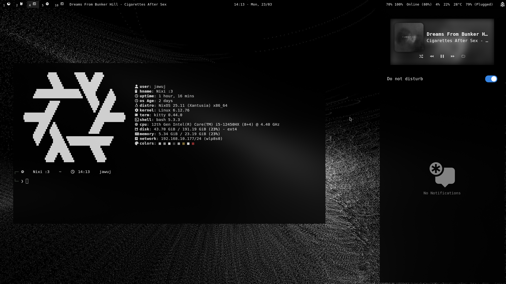
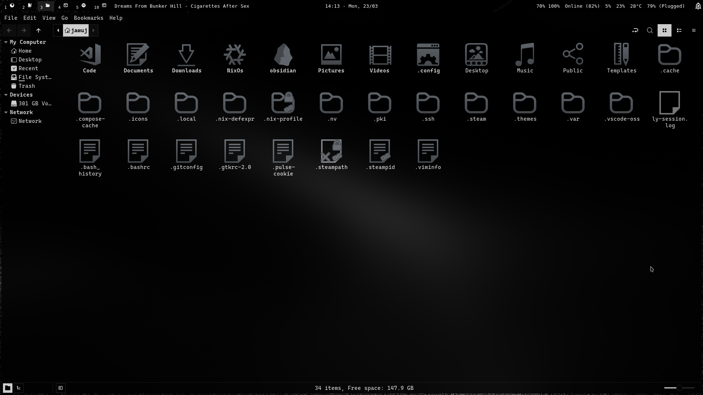
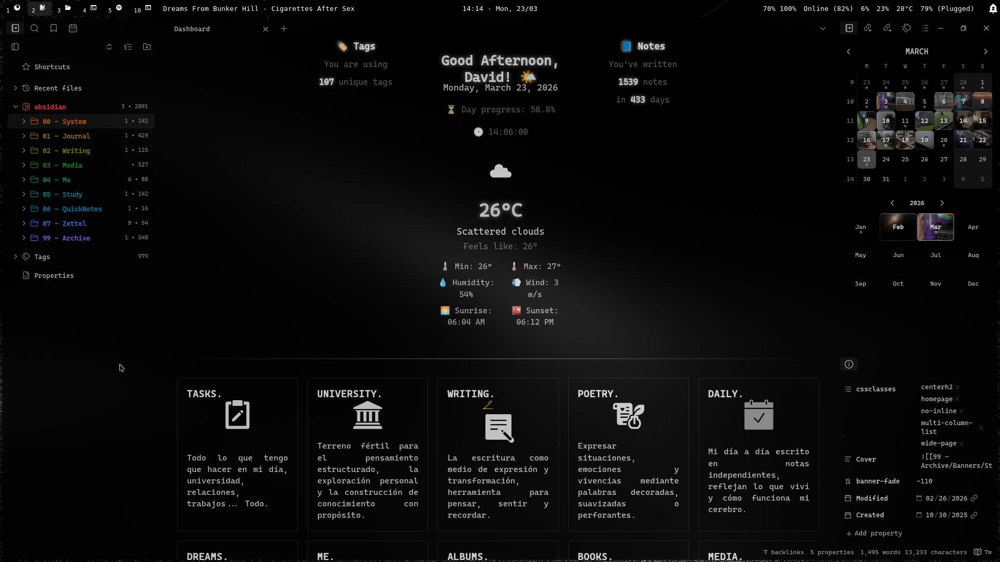
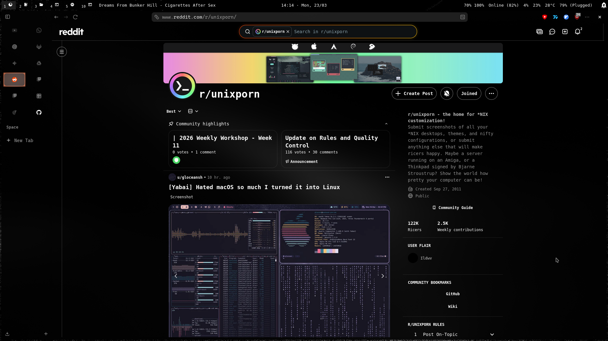
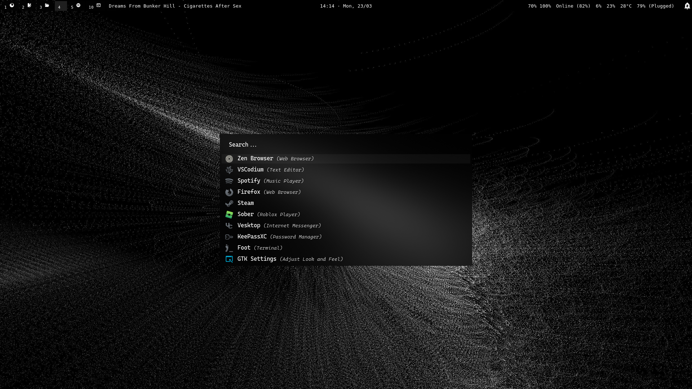
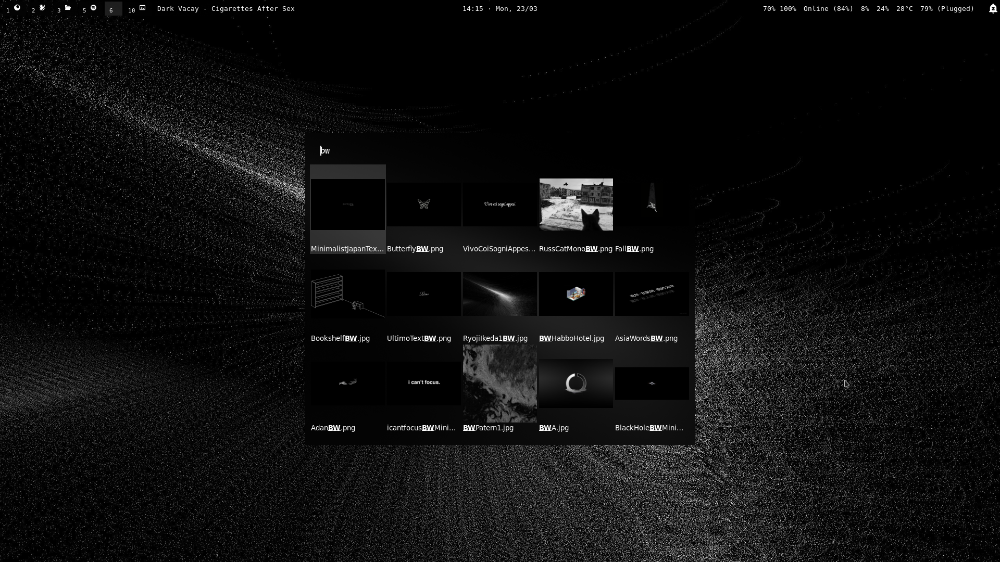
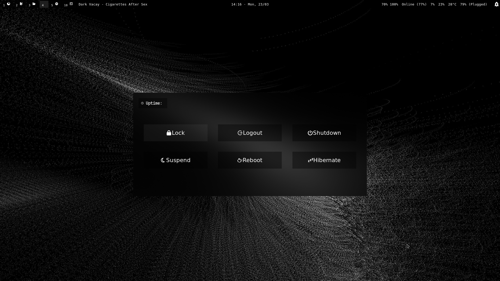

## Black & White (Arch Base)

<table>
  <tr>
    <td></td>
    <td></td>
  </tr>
  <tr>
    <td></td>
    <td></td>
  </tr>
  <tr>
    <td></td>
    <td></td>
  </tr>
  <tr>
    <td colspan="2" align="center">
      
    </td>
  </tr>
</table>

---

<video src="Images/Videos/VideoDot.mp4" width="100%" controls muted autoplay loop>
</video>

---

## System

- **OS:** Arch Linux
- **WM / Compositor:** Hyprland (Wayland)
- **GPU:** NVIDIA (Oficial Drivers)
- **Login Manager:** Ly
- **Bar:** Waybar
- **Launcher:** Rofi
- **Logout:** Rofi

---

## UI / Aesthetic

- **Font UI / Terminal:** CaskaydiaCove Nerd Font
- **GTK Theme:** Black And White
- **Icons:** Besgnulinux Mono Gry
- **Cursor:** Capitaine

---

## Terminal & CLI

- **Terminal:** Kitty
- **Shell Prompt:** Starship
- **System Info:** Fastfetch
- **Shell:** zsh

---

## Core Applications

- **Browser:** Zen Browser
- **Notes / PKM:** Obsidian
- **Music:** Spotify + Spicetify
- **Code Editor:** Vscodium
- **File Managers:** Yazi - Nemo 
- **Games Installed:** Roblox 
- **Streaming / Record:** OBS Studio

---
