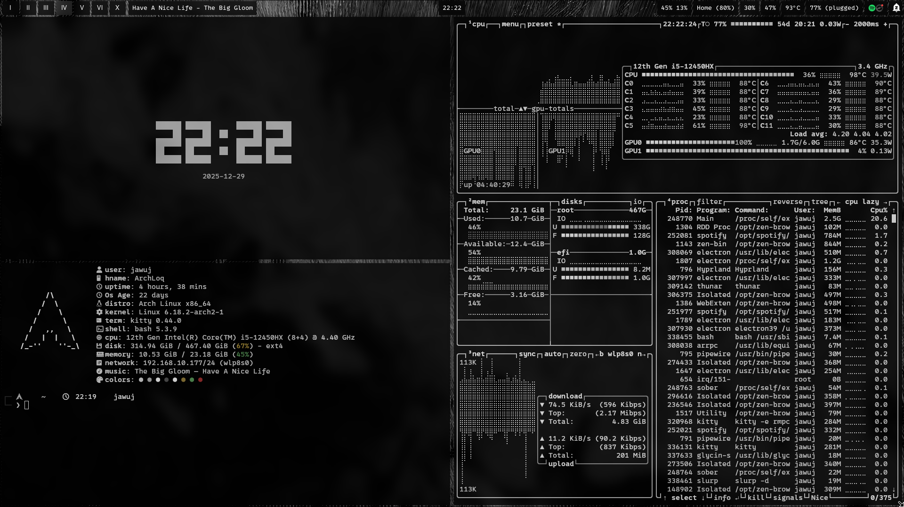
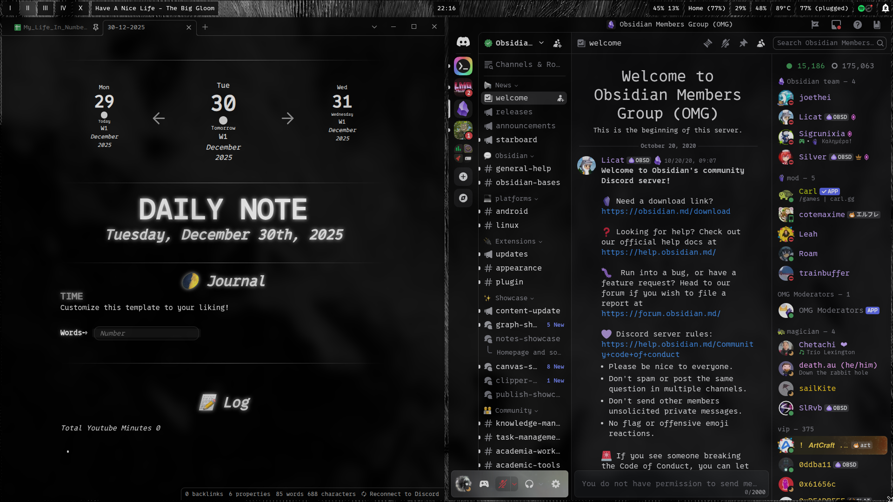
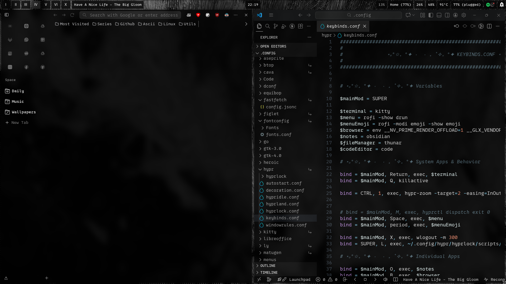
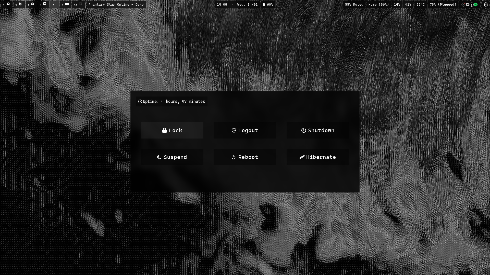
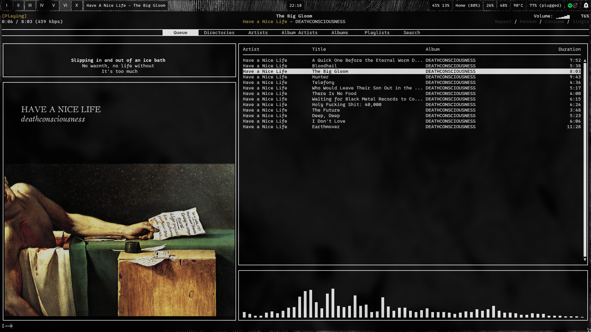

## Black & White (Arch Base)

<table>
  <tr>
    <td></td>
    <td></td>
  </tr>
  <tr>
    <td></td>
    <td></td>
  </tr>
  <tr>
    <td></td>
    <td></td>
  </tr>
</table>

---

> **This repository is for showcase purposes only.**  
> That’s why you won’t find the `.config` folder here.
> 
## System

- **OS:** Arch Linux
- **WM / Compositor:** Hyprland (Wayland)
- **GPU:** NVIDIA (Oficial Drivers)
- **Login Manager:** Ly
- **Bar:** Waybar
- **Launcher:** Rofi
- **Lock / Logout:** Hyprlock · Wlogout

---

## UI / Aesthetic

- **Font UI / Terminal:** 0xProto Nerd Font
- **GTK Theme:** Black And White
- **Icons:** Yet Another Monochrome Icon Set

---

## Terminal & CLI

- **Terminal:** Kitty
- **Shell Prompt:** Starship
- **System Info:** Fastfetch
- **Audio Visualizer:** Cava
- **Music Daemon:** MPD + MPC + rmpc

---

